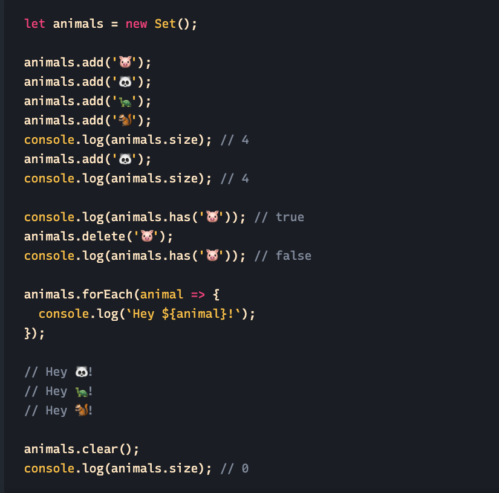
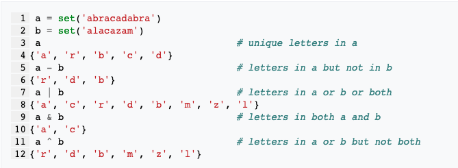

## Sets

*A set is similar to an array. An array will list out all items, no matter the quantities of each item. But a set can only have one item listed one time- there can be no repetitions. If an existing item is already in the set, you can’t add it. 

This can be useful for unique items, such as unique usernames, customer names, or a unique list of tags on blog posts. 

## Examples
* Example from https://alligator.io/js/sets-introduction/

* Example from https://computersciencewiki.org/index.php/Sets

## Real life scenario that sets would solve for: 

* Users are trying to gain likes and visibility on YouTube - using a set would make It so that the user can’t monopolize their unfair presence on that platform. In sets, the same data type cannot store the repeated value. It can be used for a username that already is in place, to avoid unintentional duplication. 

## Other resources: 
* https://developer.mozilla.org/en-US/docs/Web/JavaScript/Reference/Global_Objects/Set